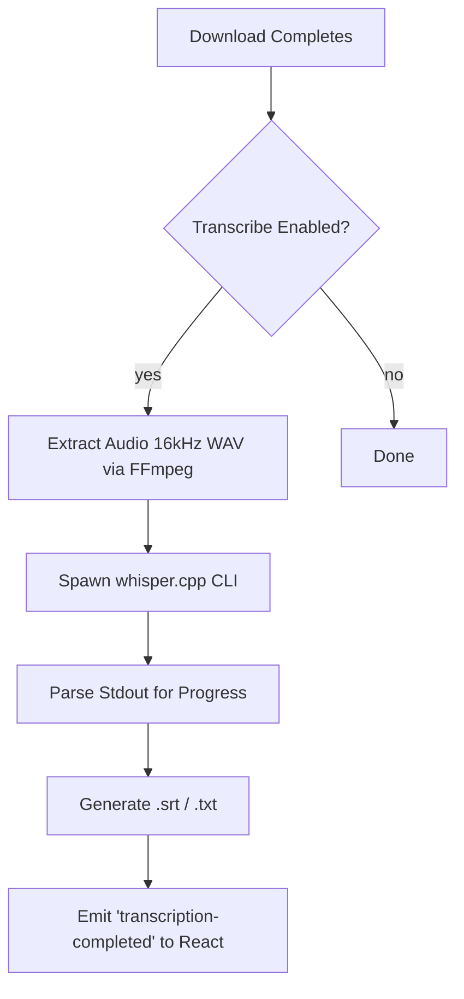

# OpenWhisper Transcription

## Summary

Integrate local, on-device audio/video transcription into the YouTube Downloader application using OpenWhisper (`whisper.cpp`). This will allow users to automatically generate high-quality text transcripts (VTT/SRT/TXT) for the videos they download without relying on external cloud APIs, ensuring privacy and offline capability.

***

## Problem Frame

### Current state
- The app successfully downloads media files and delegates downloading to `aria2c` and `yt-dlp`.
- Basic model management for Whisper `.bin` files is implemented in `src-tauri/src/whisper.rs`.
- Missing: Execution logic to run the transcription and a UI to manage models and toggle transcription settings.

### User pain
- Users who need transcripts for study, accessibility, or content processing currently have to use third-party tools to transcribe the downloaded media.
- Setup for local AI models is typically too complex for the average user.

### Why now
- AI-driven workflows are increasingly standard, and having on-device transcription directly alongside the download manager creates a seamless, highly competitive user experience.

***

## Goals

- Provide a UI for users to view, download, and select OpenWhisper models.
- Automatically or manually trigger transcription on downloaded media files.
- Execute transcription locally using optimized `whisper.cpp` binaries to avoid heavy memory or build requirements.
- Output standard transcript formats alongside the media (e.g., `.srt`, `.txt`).

## Non-goals

- Real-time live transcription of streams.
- Cloud-based transcription (must remain local/on-device).
- Training or fine-tuning models.

***

## Requirements

- **R1.** The app must automatically download the `whisper.cpp` binary sidecar (similar to `aria2c`) if missing.
- **R2.** The UI must display available models from the local `models/` directory.
- **R3.** The UI must allow users to download recommended models (`ggml-tiny.bin`, `ggml-base.bin`, etc.).
- **R4.** The app must extract audio from the downloaded video (using `ffmpeg`) and feed it to the Whisper CLI.
- **R5.** Transcription progress and status must be reported back to the React frontend.
- **R6.** Transcription must be cancellable via process management.
- **R7.** The app must gracefully handle missing models or binaries by prompting the user.

***

## Success Criteria

- User can download a video and optionally have a `.srt` file generated next to it automatically.
- The `whisper.cpp` binary and models install without requiring C++ build tools on the user's OS.
- The UI accurately reflects the download state of both the models and the transcription process.

***

## Key Technical Decisions

- **Use Pre-compiled `whisper.cpp` binaries** — Instead of using the `whisper-rs` crate (which requires a C++ toolchain to compile on the host machine), we will download pre-compiled binaries via `binary_downloader.rs`. This mirrors the existing, robust `aria2c` installation flow and prevents build failures on Windows.
- **FFmpeg audio extraction** — `whisper.cpp` expects 16kHz WAV files. We will use the existing `ffmpeg` binary (or add it if missing) to extract and resample audio from the downloaded video prior to transcription.
- **React-based Settings Tab** — A new settings section will manage the local AI state (model downloads and active model selection), decoupled from the main download queue but accessible via state.

***

## Alternatives Considered

### Option A — Use `whisper-rs` crate
- Pros: Tighter Rust integration, direct FFI calls without spawning subprocesses.
- Cons: Requires CMake and a C/C++ compiler on the host during cargo build. Highly problematic for Windows users without Visual Studio tools.
- Rejected because: Cross-platform distribution and compilation overhead outweighs the minor performance gain of FFI over CLI subprocesses for asynchronous tasks.

### Option B — Cloud APIs (OpenAI Whisper API)
- Pros: No local compute required, very fast.
- Cons: Costs money, requires API keys, privacy concerns.
- Rejected because: The goal is local, privacy-respecting "heavy lifting".

***

## High-Level Design

### Data flow



### Component / module architecture

```text
src-tauri/src/
├── whisper.rs           # (Existing) Model management + Execution logic
├── binary_downloader.rs # (Modify) Add whisper-cli fetching
└── downloader.rs        # (Modify) Trigger transcription post-download

src/
├── components/
│   ├── settings/
│   │   └── WhisperModelManager.tsx  # (New) UI for model downloads
│   └── downloads/
│       └── DownloadQueue.tsx        # (Modify) Show transcript status
```

### State ownership
- **Backend (Rust):** Owns the `models/` directory state, the binary installation state, and the active `CommandChild` process for transcription.
- **Frontend (React):** Owns the user preference (`isTranscriptionEnabled`, `selectedModel`) and visual representation of progress.

***

## UX Behavior

### Default
- Transcription is disabled by default to save CPU/Battery.
- The "Transcription" settings tab shows available models as "Not Downloaded".

### Active interaction
- User clicks "Download" on `ggml-base.bin`. A progress bar appears.
- User toggles "Auto-transcribe videos" to ON.
- During video download, a secondary progress bar or status text ("Transcribing...") appears under the queue item once the main download hits 100%.

### Empty / edge states
- If a user triggers transcription but no model is downloaded, an alert dialog directs them to the Settings tab to download one.
- If the hardware is too slow, transcription can be cancelled manually via the queue UI.

***

## Scope Boundaries

### In scope
- Downloading `whisper.cpp` CLI binary and `.bin` models.
- Transcribing English and auto-detecting languages (based on the chosen model).
- Outputting `.srt` and `.txt`.

### Deferred
- GPU acceleration support (CUDA/CoreML binaries require hardware-specific distributions which complicates the downloader). We will rely on CPU inference (AVX2/AVX) for Phase 1.
- Live audio transcription from a microphone.

### Out of scope
- Translation to other languages (Translate tasks in Whisper).

***

## Implementation Units

### U1. Backend Binary Management

**Goal:** Ensure `whisper.cpp` executable is available on the host machine.  
**Requirements:** R1  
**Dependencies:** None

**Files:**
- `src-tauri/src/binary_downloader.rs` (modify)
- `src-tauri/src/whisper.rs` (modify)

**Approach:**
1. Define the release URL for pre-compiled `whisper.cpp` binaries based on the OS target.
2. Implement `ensure_whisper_cli()` in `binary_downloader.rs` mirroring the `ensure_aria2c()` logic.
3. Call this check during app startup in `lib.rs`.

**Patterns:** Existing `aria2c` zip extraction and caching.

***

### U2. Transcription Execution Engine

**Goal:** Extract audio and run the model on it.  
**Requirements:** R4, R5, R6  
**Dependencies:** U1

**Files:**
- `src-tauri/src/whisper.rs` (modify)

**Approach:**
1. Create `transcribe_file(video_path, model_name, output_dir)` command.
2. Run `ffmpeg -i <video> -ar 16000 -ac 1 -c:a pcm_s16le audio.wav` using `CommandChild`.
3. Spawn `whisper-cli -m models/<model> -f audio.wav -osrt`.
4. Parse the CLI stdout to emit progress events (`transcription-progress`) to the frontend.

**Patterns:** The event-emitting subprocess loop used in `downloader::download_video_with_child`.

***

### U3. React UI - Model Manager

**Goal:** Allow users to view and download models.  
**Requirements:** R2, R3  
**Dependencies:** None

**Files:**
- `src/components/WhisperSettings.tsx` (new)
- `src/App.tsx` (modify)

**Approach:**
1. Fetch models via `invoke("get_available_models")`.
2. Display a list of models with size and status.
3. Add a "Download" button that calls `invoke("download_whisper_model", { modelName })`.
4. Add a global setting toggle to enable/disable auto-transcription.

**Patterns:** Standard Tailwind UI cards matching the existing app theme.

***

## Testing Strategy

### Unit
- Test audio extraction args string building.
- Test parsing of `whisper.cpp` stdout progress lines to ensure percentage is calculated accurately.

### Integration
- Download a short 5-second video, trigger transcription, and verify `.srt` file generation on disk.

### Manual QA
- Kill the app mid-transcription to ensure the subprocess is cleaned up.
- Test downloading a model while offline (expect proper error).
- Test with spaces and special characters in the video filename.

***

## Performance Considerations

- Transcription is extremely CPU intensive. The UI must remain responsive while the sidecar process consumes CPU cores.
- Using `ffmpeg` to extract `.wav` requires temporary disk space (~10MB/min of audio). Temporary files must be cleaned up reliably in a `Drop` guard or via explicit cleanup steps.

***

## Accessibility

- The Settings UI for models must be keyboard navigable.
- Progress updates should be conveyed via ARIA roles (e.g., `role="status"` or `aria-live="polite"`) so screen readers announce "Transcription complete".

***

## Persistence & Configuration

- Settings will be expanded to include Whisper preferences.

```ts
type AppSettings = {
  // existing settings...
  auto_transcribe: boolean;
  whisper_model: string; // e.g., "ggml-base.bin"
};
```

***

## Telemetry / Debugging

- Log output from `whisper.cpp` to `stderr` for developer console inspection.
- Explicit logging when `ffmpeg` fails to extract audio, as this is the most common failure point for unsupported codecs.

***

## Rollout Plan

### Phase 1
- Ship UI and backend binary downloader. Feature is manual-only (user clicks "Transcribe" on a finished download).

### Phase 2
- Introduce Auto-Transcribe setting tied into the `download_manager` queue logic.

### Rollback
- If `whisper.cpp` changes CLI signatures and breaks, disable the feature gracefully by wrapping the execution in a `match` that returns a safe "Transcription unavailable" error to the frontend.

***

## Open Questions

- Should we bundle a tiny model (e.g., `ggml-tiny.bin` is ~75MB) with the installer to provide immediate offline functionality, or strictly require the user to download it post-install to keep the app size small? *(Recommendation: Keep installer small, prompt download on first use).*
- Which format do we default to? `.srt`, `.vtt`, or `.txt`? *(Recommendation: `.srt` as it is widely supported by media players).*

***

## Sources / References
- [whisper.cpp GitHub Repository](https://github.com/ggerganov/whisper.cpp)
- Existing `src-tauri/src/binary_downloader.rs` for sidecar management approach.
